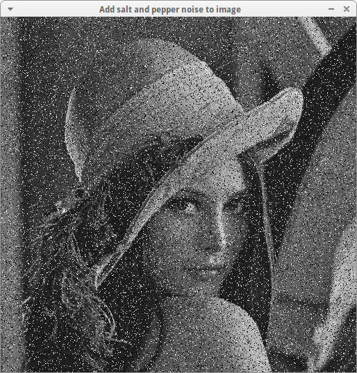

# Chapter 1: Spatial Filtering - Smoothing Filters

## Spatial filtering
It is a technique of sliding window (mask) over the image, computing new center value based on it's neighbors.

### Box filtering       
It is one of the implementations of this technique, we change each pixel by computing average of all the pixels. We must normilize this filter in order to avoid sum > 1, which will make image too bright or sum < 1 which makes image too dark. If we make value. 

Example image:      
[ 10  20  30  40  50 ]      
[ 15  25  35  45  55 ]      
[ 20  30  40  50  60 ]      
[ 25  35  45  55  65 ]      
[ 30  40  50  60  70 ]      

Apply 3x3 box filter        
[ 25  35  45 ]      
[ 30  40  50 ]      
[ 35  45  55 ]      

Calculate the average:      
Sum = 25+35+45+30+40+50+35+45+55 = 360      
Average = 360/9 = 40        
The center pixel stays 40       

**Kernel size** directly affects blurring effect. The larger the kernel, the more local detail gets averaged out.
3×3 kernel: Averages over 9 pixels (small neighborhood)     
21×21 kernel: Averages over 441 pixels (huge neighborhood)      

### Gaussian filter
Instead of giving equal weight to all neigbors like box filter (kernel consists from 1s), gaussian gives more weight to closer pixels and less weight to farther pixels. The kernel should always be odd, to have a clear center.

**Circular Symmetry** this means the filter treats equally all pixels regardless direction. Box does not follow the rule, while gaussian does.

**Padding methods**, when we reach borders of images with kernel, some of our neighbots will be outside of the box, we need to decide what to do with them.

    1. Zero padding. When we add zeroes to the borders.
    Original:  [ 100  120  140 ]
    Padded:    [ 0  0  100  120  140  0  0 ]
    Effect: We create dark borderes and reduce average near the borders

    2. Mirror padding. When we reflect the pixels of images
    Original:  [ 100  120  140 ]
    Padded:    [ 140  120  100  120  140  120  100 ]
    Effect: We reflect image symetrically, and hence have better results.

    3. Replicate. When we extend the image's details.
    Original:  [ 100  120  140 ]
    Padded:    [ 100  100  100  120  140  140  140 ]
    Effect: We extend edge values. But we can create slight discontinuities.

    Best practice: Mirror padding for the most cases, because it maintains natural transitions.

### Median filtering
Unlike Gaussian and box fileting, where we use average to find a center pixel, here we use order statictics.
We get all the neighbors, sort them in order, and take median value (center value), replace center with median.

Example: Removing Salt-and-Pepper Noise
Neighborhood with impulse noise:
[ 12  15  14 ]
[ 13  255  15 ]  ← Center pixel is corrupted (255 = white noise)
[ 16  14  13 ]
Step 1: Extract values: [12, 15, 14, 13, 255, 15, 16, 14, 13]
Step 2: Sort: [12, 13, 13, 14, 14, 15, 15, 16, 255]
Step 3: Median = 14 (the middle value)
Result: The noise spike (255) is completely removed! The median is 14.

**Salt-and-Pepper noise** is when we have random black and white dots on images

To solve this problem, best option is median filter. First of all those big numbers (black 0 and white 255 dots) go to the beginning or the end of the ordered list. Second, median is a "typical" pixel on the image, so almost no changes is visible.

**Illumination / shading correction** this is a certain image, that has illumination (Imagine an image with a landscape, with stones and trees, besides that we also have one big mountain hill, object like stones and trees has a brightness transition very quickly, but hill this is like a massive object, it starts bright on the left and gets slightly darker on the right, this change is "slow" because it takes 100 or 200 pixels to notice the difference). Which means a bad lightning, for example it causes problem when we try to apply tresholding. Solution is to apply gaussian blur.

When you apply a massive Gaussian Filter (like 101x101):
You are telling the computer to blur everything so much that the "mountains" (the objects/details) disappear, leaving only the "giant hill" (the lighting pattern). After that we resulted image and subtract it from original one.

## Sharpening Filters

### High pass filters vs Low Pass filters

We have two main brightness domains in the images:      
Low frequencies - when brightness changes slowly (like in large objects).        
High frequencies - when brightness changes fast (lines, new objects).        

**Low pass filter** - helps us smooth those fast fast changing brightness parts, creating a blur effect. (deals with high frequencies).      
**High pass filters** - helps us makes keep fast changing details, and get rid off "slow" parts to sharpen the image. (deals with low frequencies).      

### First-Order Derivatives (Sobel)

**Derivative** measures the rate of change of intensity. Formula: f'(x) = f(x+1) - f(x).         
Example:        
Intensity profile: [ 100  100  100  150  200  200  200 ]        
First derivative:  [   0    0   50   50    0    0      ]    

Why First Derivatives Give Thick Edges? If we take an example of this edge: [ 50  50  60  80  120  160  180  190  200  200 ].

The intensity changes slowly. But deravitive can calculate only the change of two pixels at a time, meaning how much current pixel changed from previous one? Hence each check it marks a change as a new edge, as a result we get thick line.

### First-Order Gradient Operators

**Roberts Cross Operator**      
Gx = [ 1   0 ]      Gy = [ 0   1 ]      
     [ 0  -1 ]           [-1   0 ]      

To detect diagonal edges, very sensitive to noise.       

**Sobel operator**      

Gx = [-1  0  1 ]      Gy = [-1 -2 -1 ]      
     [-2  0  2 ]           [ 0  0  0 ]      
     [-1  0  1 ]           [ 1  2  1 ]      

To detect horizontal and vertical edges, has it's own smoothing effect (look at 1, 2, 1). good for noisy images.     

###  Second-Order Derivatives (Laplacian)

Formula: f''(x) = f(x+1) + f(x-1) - 2×f(x)

This gives us more precise deravitive localization. Because of the concept named: Zero crossing, which means 